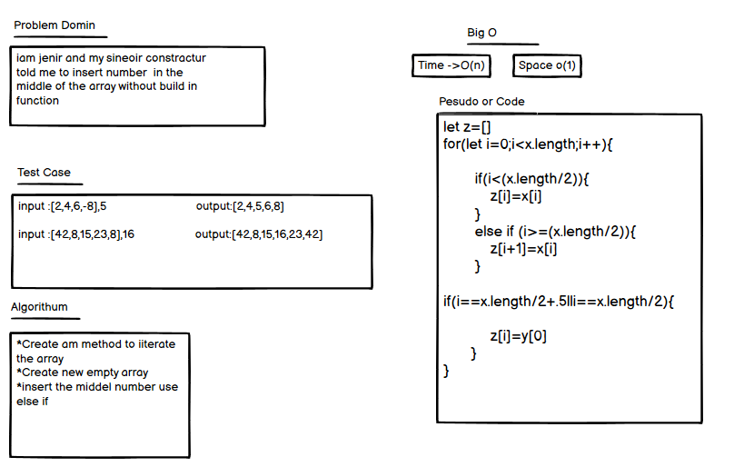

# insert shift
you have array of number you need  to reversed
## Whiteboard Process

## Approach & Efficiency
i wnat to make for loop the o(1) it round one time

## My Pull request 
[press here](https://github.com/lithhalim/data-structures-and-algorithms/pulls)

#### q1 how long this assignment took you in the comments box.
1houre
#### ny additional comments to your grader about your process or any difficulties you may have had with the assignment.
no thank