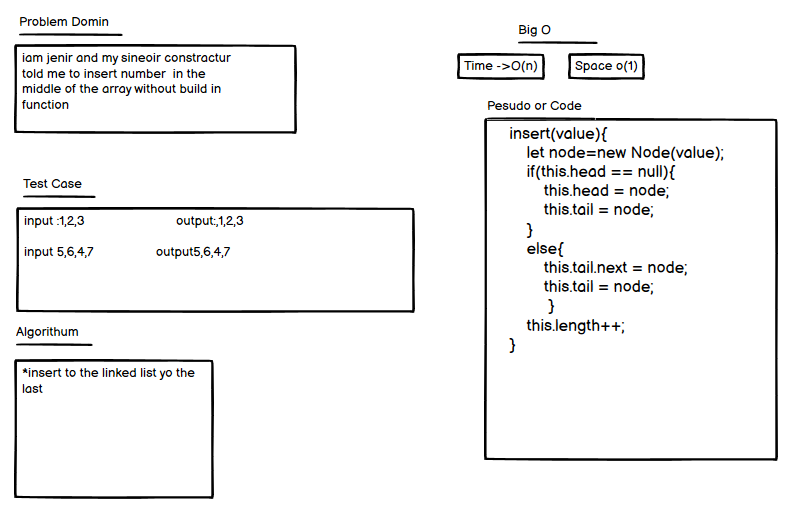
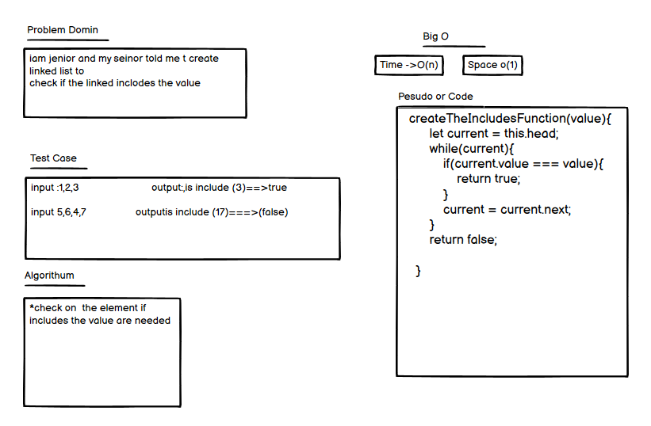
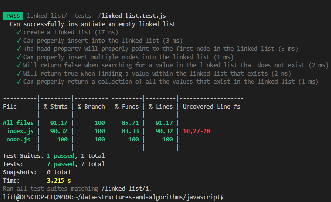

# Linked List
A linked list is a linear data structure, in which the elements are not stored at contiguous memory locations. The elements in a linked list are linked using pointers as shown in the below image:
## Whiteboard Process
##### the insert section

##### the include section

##### the string section

## The Test Of the Application

## The pull request link
[Pull Request](https://github.com/lithhalim/data-structures-and-algorithms/pull/21)

## The pull request link
[Pull Request](https://github.com/lithhalim/data-structures-and-algorithms/pull/21)
## The Link Of the File
[File Linkedlist](https://github.com/lithhalim/data-structures-and-algorithms/tree/main/javascript/linked-list)

## Approach & Efficiency
i wnat to make for linked list the o(1) it round one time

## If You want to check the code you need to go to Linked List file 
## for the test press npm test linked-list

