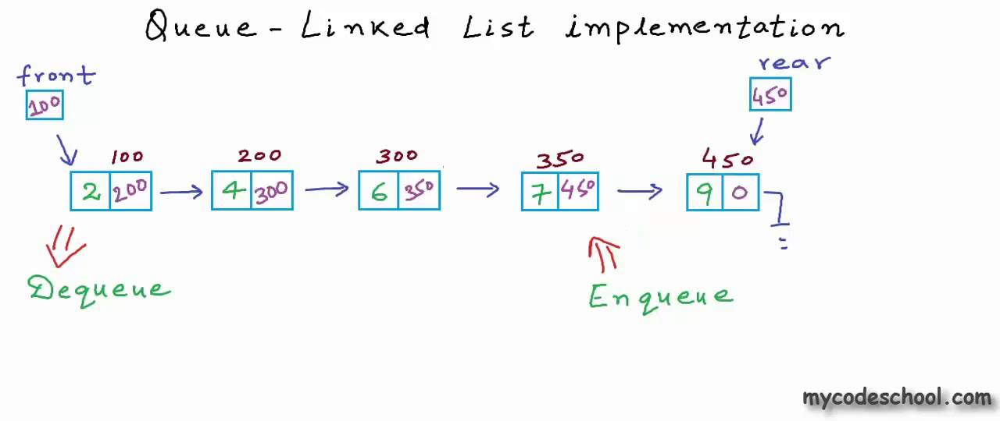
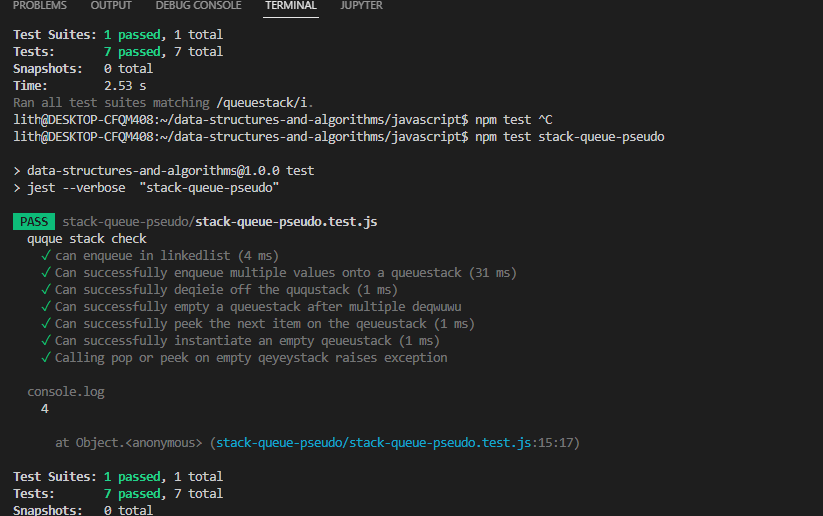

## project fole press heree***************************
[project file](https://github.com/lithhalim/data-structures-and-algorithms/tree/main/javascript/stackandqueue)
## action 
[action](https://github.com/lithhalim/data-structures-and-algorithms/actions)
## pull request
[pull request](https://github.com/lithhalim/data-structures-and-algorithms/pulls)

# qeueu stack
Create a Node class that has properties for the value stored in the Node, and a pointer to the next node
## Whiteboard queue

## authrization 

## test 

## Approach & Efficiency
i wnat to make for loop the o(1) it round one time