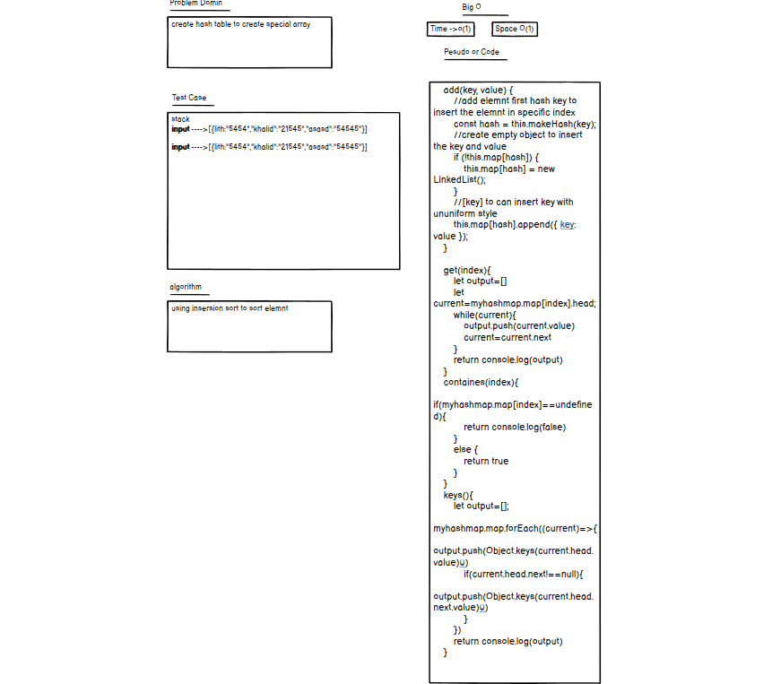

# hash table
In computing, a hash table, also known as hash map, is a data structure that implements an associative array or dictionary, an abstract data type that maps keys to values.

## Whiteboard Process
##### the insert section

##### the authrization section

## The Link Of the File
[Press here!!!!!!!!!!!!!!!!!!](https://github.com/lithhalim/data-structures-and-algorithms/tree/main/javascript/section2/hashtable)

## The pull request link
[Pull Request](https://github.com/lithhalim/data-structures-and-algorithms/pulls)
## Approach & Efficiency
i wnat to make for linked list the o(1) it round one time

## If You want to check the code you need to go to Linked List file 
## for the test press npm test linked-list

