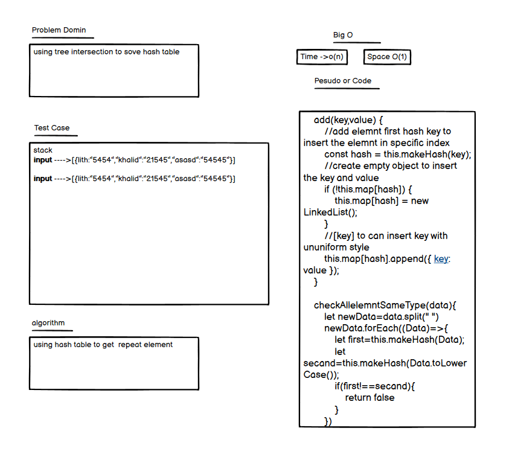

## Interview Link  FIRST
 - [Whiteboard Code Interviw](https://docs.google.com/spreadsheets/d/1azIBIWk1uMr_V6iE7Ghf-NFF7AbWJyc98W4jQaNO8sw/edit?usp=sharing)
 - [ops technical interview qustion](https://docs.google.com/spreadsheets/d/14K4TE5w899IDqXug-SIYxrwpBCJIkhoVu6bcUW0Nf3I/edit?usp=sharing)
 - [ops technical interview qustion](https://docs.google.com/spreadsheets/d/1LodP4LsyA6O2ahx0g5X8PWMSfAK_ZmW7cp6OjuYC5Qo/edit?usp=sharing)

## Interview Link SECAND

 - [Whiteboard Code Interviw](https://docs.google.com/spreadsheets/d/1KQQRfX5PyHSDXU3k5GE7eFRSPMfv7s8NmwZOKtXtpLA/edit?usp=sharing)
 - [ops technical interview qustion](https://docs.google.com/spreadsheets/d/1ikDh4MWKXvOrK3dO69IQn47xFl7IEVdDb_KnN4CrqH0/edit?usp=sharing)
 - [ops technical interview qustion](https://docs.google.com/spreadsheets/d/1u60ol6rTfqKt_UZBfr44z8HmSSeJsxbNCM3xHE6qlic/edit?usp=sharing)

<h2 align="center">First Interview</h2>

# get the hash table
you need to reverse linked l ist
## Whiteboard Process

###### authriization

## Approach & Efficiency
i wnat to make while loop the O(1) it round one time

<h2 align="center">secand Interview</h2>

# hash table
you have linked list you need the polidmer
## Whiteboard Process

###### visulization

## Approach & Efficiency
i wnat to make while loop the O(N) it round one time
