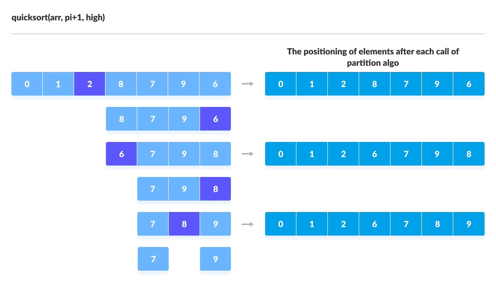

## Interview Link  FIRST
 - [Whiteboard Code Interviw](https://docs.google.com/spreadsheets/d/1CmQCw1lKzjHNShurwI0lOo00ZbinxKNIX-mkJaCvo0A/edit?usp=sharing)
 - [ops technical interview qustion](https://docs.google.com/spreadsheets/d/1FHjYqITjavCJlQcPxyofSVyydNaN2pwhRc7x5kP2DPQ/edit?usp=sharing)
 - [ops technical interview qustion](https://docs.google.com/spreadsheets/d/13XHZiufrseqahjH4WND4dTs2-KyZh-KV5Vdo1muOqX4/edit?usp=sharing)

## Interview Link SECAND

 - [Whiteboard Code Interviw](https://docs.google.com/spreadsheets/d/1KQQRfX5PyHSDXU3k5GE7eFRSPMfv7s8NmwZOKtXtpLA/edit?usp=sharing)
 - [ops technical interview qustion](https://docs.google.com/spreadsheets/d/1ikDh4MWKXvOrK3dO69IQn47xFl7IEVdDb_KnN4CrqH0/edit?usp=sharing)
 - [ops technical interview qustion](https://docs.google.com/spreadsheets/d/1u60ol6rTfqKt_UZBfr44z8HmSSeJsxbNCM3xHE6qlic/edit?usp=sharing)

<h2 align="center">First Interview</h2>

# get the merge sort
you need to reverse linked l ist
## Whiteboard Process

###### authriization

## Approach & Efficiency
i wnat to make while loop the O(1) it round one time

<h2 align="center">secand Interview</h2>

# qucik sort
you have linked list you need the polidmer
## Whiteboard Process

###### visulization

## Approach & Efficiency
i wnat to make while loop the O(N) it round one time
